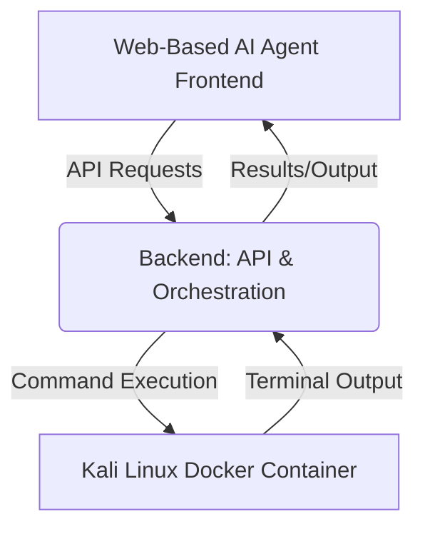

# Integrating a Kali Linux Sandbox Terminal with a Web-Based AI Agent

## Introduction

This document outlines a robust and secure architecture for integrating a Kali Linux sandbox terminal with a web-based AI agent. The primary goal is to provide the AI agent with a powerful, isolated environment for executing cybersecurity tools and commands, while ensuring the safety and integrity of the host system and sensitive data. This integration leverages containerization, web-based terminal technologies, and a well-defined API for agent interaction.

## Core Architectural Principles

Before diving into the technical details, it's crucial to establish the core principles guiding this architecture:

1.  **Isolation:** The Kali Linux environment must be completely isolated from the host system and other services to prevent any malicious or erroneous actions from affecting the broader infrastructure [2].
2.  **Least Privilege:** The AI agent and the sandbox environment should only have the minimum necessary permissions to perform their designated tasks.
3.  **Secure Communication:** All communication between the web-based AI agent, the backend, and the Kali Linux sandbox must be encrypted and authenticated.
4.  **Auditability:** All actions performed within the sandbox by the AI agent should be logged for auditing and debugging purposes.
5.  **Scalability:** The solution should be designed to scale, allowing for multiple concurrent sandbox instances if needed.

## High-Level Architecture

The integration can be conceptualized into three main layers:

1.  **Frontend (Web-Based AI Agent Interface):** This is the user-facing component where the AI agent operates. It provides an interface for the AI to receive tasks, display terminal output, and potentially visualize results.
2.  **Backend (API & Orchestration):** This layer acts as the intermediary between the AI agent and the sandbox. It handles requests from the AI, orchestrates the creation and management of sandbox instances, and relays commands and outputs.
3.  **Kali Linux Sandbox (Containerized Environment):** This is the isolated execution environment running Kali Linux, where the actual cybersecurity tools are executed.



## Component Breakdown and Workflow

### 1. Containerization: Kali Linux Docker Container

Docker is the ideal choice for containerizing Kali Linux due to its lightweight nature, portability, and strong isolation capabilities. This allows for rapid deployment of new sandbox instances and ensures a consistent environment [3].

**Key Considerations:**

*   **Base Image:** Utilize the official `kalilinux/kali-rolling` Docker image as the base. This provides a minimal yet functional Kali Linux environment.
*   **Tool Installation:** Depending on the specific needs of the AI agent, additional tools can be installed within the Dockerfile or dynamically installed by the agent itself (within the sandbox).
*   **Resource Limits:** Implement strict CPU, memory, and network limits for each container to prevent resource exhaustion and potential denial-of-service attacks against the host [2].
*   **Non-Root User:** Run processes within the container as a non-root user to minimize potential damage if the container is compromised.
*   **Read-Only Mounts:** Where possible, mount parts of the filesystem as read-only to prevent unauthorized writes.

**Example Dockerfile Snippet:**

```dockerfile
FROM kalilinux/kali-rolling

# Install necessary packages for web terminal (e.g., ttyd, noVNC components)
RUN apt-get update && apt-get install -y --no-install-recommends \
    ttyd \
    # Add other tools as needed, e.g., nmap, metasploit-framework
    && apt-get clean && rm -rf /var/lib/apt/lists/*

# Create a non-root user
RUN useradd -ms /bin/bash agentuser
USER agentuser
WORKDIR /home/agentuser

# Expose the port for the web terminal
EXPOSE 7681 # Default ttyd port

# Command to start the web terminal
CMD ["ttyd", "bash"]
```

### 2. Web-Based Terminal Access

To allow the AI agent (and potentially a human operator) to interact with the Kali Linux container via a web interface, a web-based terminal solution is required. `ttyd` is a lightweight and efficient option that serves a terminal over HTTP/HTTPS [4]. Alternatively, `noVNC` can provide a full graphical desktop environment if the AI agent requires GUI tools, though this adds complexity and resource overhead [5]. For an AI agent primarily interacting via command-line, `ttyd` is generally preferred.

**`ttyd` Integration:**

*   `ttyd` runs inside the Docker container, exposing a port (e.g., 7681) that serves the terminal.
*   The backend will connect to this `ttyd` instance to send commands and receive output.

### 3. Backend: API & Orchestration

The backend service is responsible for managing the lifecycle of Kali Linux sandbox containers and providing an API for the AI agent to interact with them.

**Key Functions:**

*   **Sandbox Provisioning:** On demand, the backend initiates a new Docker container based on the Kali Linux image. Each container should be ephemeral and destroyed after use or a defined timeout.
*   **Command Relay:** The backend receives commands from the AI agent via its API, forwards them to the `ttyd` instance within the respective Kali container, and captures the output.
*   **Output Processing:** Raw terminal output is processed (e.g., sanitized, parsed) before being sent back to the AI agent.
*   **Session Management:** Manages active sandbox sessions, associating them with specific AI agent tasks.
*   **Security Layer:** Implements authentication and authorization for API endpoints, ensuring only authorized AI agents can access sandboxes.
*   **Logging and Monitoring:** Records all commands executed, outputs, and system events for security auditing and performance monitoring.

**Technology Stack:**

*   **Language/Framework:** Python (Flask/FastAPI) or Node.js (Express) are suitable choices for building the API.
*   **Container Orchestration:** Docker API or Docker Compose for managing containers. For larger deployments, Kubernetes could be considered.
*   **Message Queue (Optional):** For asynchronous command execution and output processing, a message queue (e.g., RabbitMQ, Kafka) can be used.

### 4. Frontend: Web-Based AI Agent Interface

The web-based AI agent will interact with the backend API. This interface could be a simple web application or a more sophisticated dashboard.

**Key Features:**

*   **Command Input:** Allows the AI agent to formulate and send commands to the backend.
*   **Terminal Output Display:** Renders the output received from the backend in a user-friendly format, mimicking a terminal.
*   **Task Management:** Displays the status of ongoing tasks and associated sandbox sessions.
*   **Security Warnings:** Provides clear warnings and disclaimers about the ethical and legal implications of using cybersecurity tools.

## Security Best Practices

Given the nature of Kali Linux and cybersecurity tools, security is paramount:

*   **Network Isolation:** Implement strict network policies for Docker containers. Limit outbound connections to only what is absolutely necessary and block all inbound connections except from the backend.
*   **Host Protection:** Do not mount host directories into the Kali containers, especially with write permissions. Use Docker volumes for persistent data that needs to be shared, but ensure it's carefully managed.
*   **Ephemeral Containers:** Each task or session should ideally use a new, ephemeral container that is destroyed after completion. This prevents state leakage and ensures a clean environment for each operation.
*   **Input Validation:** Strictly validate all commands and inputs received from the AI agent before execution in the sandbox to prevent command injection attacks.
*   **Rate Limiting:** Implement rate limiting on the backend API to prevent abuse.
*   **Regular Updates:** Keep the Kali Linux base image and all installed tools up-to-date to patch known vulnerabilities.
*   **Monitoring and Alerting:** Continuously monitor sandbox activity for suspicious behavior and set up alerts for security incidents.

## Conclusion

Integrating a Kali Linux sandbox terminal with a web-based AI agent is achievable through a well-designed architecture leveraging Docker for isolation, `ttyd` for web-based terminal access, and a robust backend for orchestration and security. By adhering to strong security principles, this setup can empower AI agents with advanced cybersecurity capabilities in a controlled and safe manner.

## References

[1] Z4nzu/hackingtool GitHub Repository. (n.d.). *hackingtool*. Retrieved from https://github.com/Z4nzu/hackingtool
[2] Firecrawl. (2026, March 18). *AI Agent Sandbox: How to Safely Run Autonomous Agents in 2026*. Retrieved from https://www.firecrawl.dev/blog/ai-agent-sandbox
[3] Kali Linux. (n.d.). *Using Kali Linux Docker Images*. Retrieved from https://www.kali.org/docs/containers/using-kali-docker-images/
[4] TTYD GitHub Repository. (n.d.). *ttyd*. Retrieved from https://github.com/tsl0922/ttyd
[5] Kali Linux. (2025, June 18). *Kali In The Browser (noVNC)*. Retrieved from https://www.kali.org/docs/general-use/novnc-kali-in-browser/
